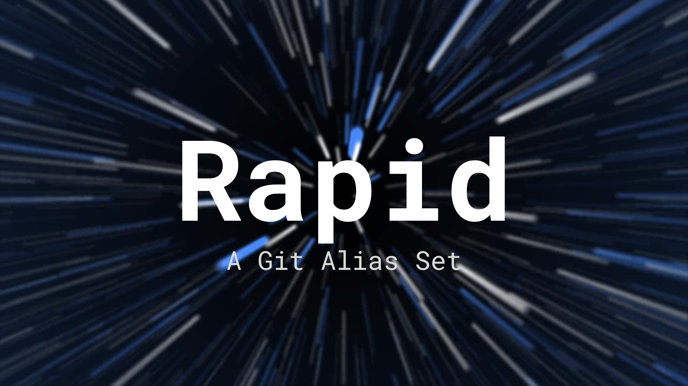

# Rapid


This script provides a full suite of Git command aliases for Windows users via the `g.bat` file. It's designed to speed up your Git workflow and make commonly used commands easier to type.

## Usage
1. Place `g.bat` directly in the `C:\Users\%USERPROFILE%\Scripts\` folder of your system path.
2. Add the folder to your PATH, by open the start menu and search for `Environment Variables`. Once open, select the `PATH` variable, and select `Edit`. In the new window, select `New` and type in `C:\Users\%USERPROFILE%\Scripts\`, replacing `%USERPROFILE%` with your username. Finally, select `OK` and close the remaining window.
3. Once in your PATH, use the new commands by typing `g <alias>` in your Git-enabled terminal.

**Once installed, you're ready to go!** To test the effectiveness, you can try some commands like the following:
For example, to commit changes and push to a repository:
```bash
g st             # git status
g a file.ext     # git add file.ext
g cm -m "msg"    # git commit -m "msg"
g psm            # git push origin main
```
Alternatively, you could use any other push command, detailed below.

## Included Aliases
#### Custom commands
| Alias | Command | Description |
| -------- | -------- | -------- |
|`g help`|`g help`|Shows this list in the terminal|
|`g cm %args%`|`git commit -m "%args%"`|Record changes to the repository (**Quotes are not necessary** but can be used)|
|`g acp %args%`|`git add .`<br>`git commit -m "%args%"`<br>`git push`|Add file contents to the index, record changes to the repository, and update remote refs along with associated objects (**Quotes are not necessary** but can be used)|
|`g spp`|`git stash`<br>`git pull`<br>`git stash pop`|Save changes temporarily, fetch from and integrate with another repository or a local branch, apply the last stash and remove it from the stash list|
#### Setup and configuration
| Alias | Command | Description |
| -------- | -------- | -------- |
|`g cf`|`git config`|Set up your Git credentials|
#### Start a working area
| Alias | Command | Description |
| -------- | -------- | -------- |
|`g cln`|`git clone`|Clone a repository into a new directory|
|`g in`|`git init`|Create an empty Git repository or reinitialize an existing one|
#### Work on the current change
| Alias | Command | Description |
| -------- | -------- | -------- |
|`g a`|`git add`|Add file contents to the index|
|`g mv`|`git mv`|Move or rename a file, a directory, or a symlink|
|`g rst`|`git restore`|Restore working tree files|
|`g rm`|`git rm`|Remove files from the working tree and from the index|
|`g sta`|`git stash`|Save changes temporarily|
#### Examine the history and state
| Alias | Command | Description |
| -------- | -------- | -------- |
|`g bs`|`git bisect`|Use binary search to find the commit that introduced a bug|
|`g df`|`git diff`|Show changes between commits, commit and working tree, etc|
|`g gr`|`git grep`|Print lines matching a pattern|
|`g lg`|`git log`|Show commit logs|
|`g shw`|`git show`|Show various types of objects|
|`g st`|`git status`|Show the working tree status|
#### Grow, mark and tweak your common history
| Alias | Command | Description |
| -------- | -------- | -------- |
|`g bf`|`git backfill`|Download missing objects in a partial clone|
|`g br`|`git branch`|List, create, or delete branches|
|`g co`|`git commit`|Record changes to the repository|
|`g mrg`|`git merge`|Join two or more development histories together|
|`g rb`|`git rebase`|Reapply commits on top of another base tip|
|`g rs`|`git reset`|Reset current HEAD to the specified state|
|`g rv`|`git revert`|Create a new commit that undoes an earlier one|
|`g sw`|`git switch`|Switch branches|
|`g tag`|`git tag`|Create, list, delete or verify a tag object signed with GPG|
#### Collaborate
| Alias | Command | Description |
| -------- | -------- | -------- |
|`g bl`|`git blame`|Show who changed each line|
|`g cl`|`git clean`|Delete untracked files|
|`g ft`|`git fetch`|Download objects and refs from another repository|
|`g pl`|`git pull`|Fetch from and integrate with another repository or a local branch|
|`g plm`|`git pull origin main`|Fetch from and integrate with the main branch|
|`g ps`|`git push`|Update remote refs along with associated objects|
|`g psm`|`git push origin main`|Update remote refs along with associated objects from the main branch|

## Included Flags
| Alias | Flag | Description |
| -------- | -------- | -------- |
|`-fc`|`--force`|Force the operation to go through, even if it may cause conflicts or issues|
|`-rb`|`--rebase`|Rebase changes (apply commits on top of another branch) rather than merging|
|`-hd`|`--hard`|A hard reset, which discards changes and resets to a specified state|
|`-sf`|`--soft`|A soft reset. Keeps changes staged in your working directory but moves the commit pointer|
|`-br`|`--branch`|Specify the branch name to switch to or create a new branch|
|`-pt`|`--patch`|Interactive patching mode; allows you to selectively apply changes|
|`-un`|`--unset`|Unset a configuration value (useful for git config)|
|`-cf`|`--config`|Modify or set a configuration value|
|`-vb`|`--verbose`|Increase the verbosity of output for more detailed info|
|`-ia`|`--interactive`|Enable interactive mode, usually for staging or commits|
|`-qt`|`--quiet`|Suppress output, showing only essential info.|
|`-dr`|`--dry-run`|Run the command but don’t actually execute it (just simulate)|
|`-ls`|`--list`|List available items, like branches, remotes, or config settings|
|`-us`|`--upstream`|Set or show the upstream branch to track|
|`-st`|`--staged`|Operates only on staged changes|